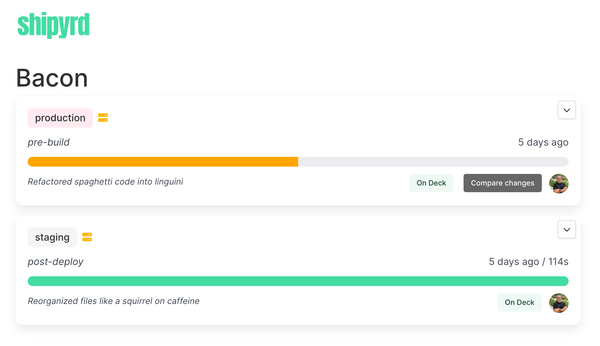

# Shipyrd

The simple deployment dashboard for Kamal-based deployments.

For a more detailed project and concept overview check out the [initial announcement details](https://www.fromthekeyboard.com/shipyrd-the-dashboard-for-your-kamal-deployments/).



## Setup

There's two main steps to getting started with Shipyrd.

1. Running Shipyrd as an accessory within your existing Kamal setup. 
2. Enable the various hooks that Kamal supports to update the deploy state in Shipyrd.

### Add shipyrd as an accessory

Within your Kamal accessories deploy configuration you'll need to add a new accessory for Shipyrd. Swap out the host IP address as well as the traefik host rule in the example below. You'll also want to point DNS towards this server unless you already have a wildcard record pointing to your host.

The accessory configuration requires two variables `SHIPYRD_API_KEY` and `SHIPYRD_HOST`.

Generate an API key(`bin/rails secret` or your favorite key generator) and set it in your env file(_.env_) as `SHIPYRD_API_KEY`, this will be the password for basic HTTP authentication. Set your `SHIPYRD_HOST` as a clear variable for the accessory.

``` yml
accessories:
  shipyrd:
    image: shipyrd/shipyrd:v0.3.4
    host: 867.530.9
    env:
      clear:
        SHIPYRD_HOST: shipyrd.myapp.com
      secret:
        - SHIPYRD_API_KEY
    labels:
      traefik.http.routers.YOURKAMALSERVICE-shipyrd.rule: Host(`shipyrd.myapp.com`)
    volumes:
      - shipyrd:/rails/db/production

```

*Make sure you update the traefik router in the configuration above to match the name of your service so that it's "#{service}-shipyrd"*

The `volumes` map is where the sqlite database will be stored which contains basic deploy information. For an overview of the information that's automatically collected with the Kamal hooks take a look at the documentation for the [shipyrd gem](https://shipyrd/shipyrd-gem).

With your accessory added and `SHIPYRD_API_KEY` in your `.env` file for Kamal you should be able to push up your environment settings and then boot the Shipyrd accessory. 

``` bash
kamal env push
kamal accessory boot shipyrd
```

### Configure your Kamal hooks

Setup the `shipyrd` gem in your Rails application by adding `shipyrd` to your *Gemfile* and then configure the various hooks.

If you're already using any of these hooks just place the below code in the hook at the point of success within the hook. If you're creating new hooks for all of these make sure that you make them all executable with `chmod +x .kamal/hooks/pre-connect` for example.

*.kamal/hooks/pre-connect*
``` ruby
#!/usr/bin/env ruby

require 'bundler/setup'
require 'shipyrd'

Shipyrd::Client.new.trigger('pre-connect')
```

*.kamal/hooks/pre-build*
``` ruby
#!/usr/bin/env ruby

require 'bundler/setup'
require 'shipyrd'

Shipyrd::Client.new.trigger('pre-build')
```

*.kamal/hooks/pre-deploy*
``` ruby
#!/usr/bin/env ruby

require 'bundler/setup'
require 'shipyrd'

Shipyrd::Client.new.trigger('pre-deploy')
```

*.kamal/hooks/post-deploy*
``` ruby
#!/usr/bin/env ruby

require 'bundler/setup'
require 'shipyrd'

Shipyrd::Client.new.trigger('post-deploy')
```

### Deploy

With the triggers added to your Kamal hooks you'll now be able to see your app go through the deploy process in Shipyrd. Once a deploy completes you'll then be able to see the changes that went out with a deploy, who deployed it, when it was last deployed, how long the deploy took. 


## Contributing

If you discover an issue, or are interested in a new feature, please open an issue. If you want to contribute code, feel free to open a pull request. If the PR is substantial, it may be beneficial to open an issue beforehand to discuss.